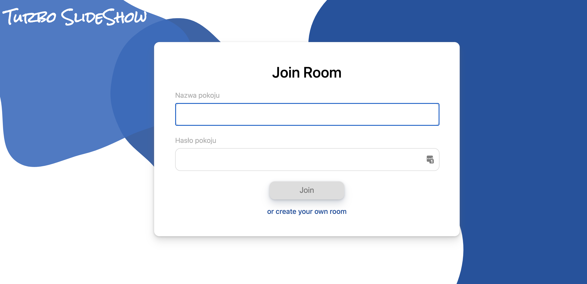

# Turbo SlideShow

- [Turbo SlideShow](#turbo-slideshow)
  - [Running locally](#running-locally)
    - [Requirements](#requirements)
    - [Installation](#installation)
  - [Used technologies](#used-technologies)
  - [Author and license](#author-and-license)

## Running locally

### Requirements

- Docker
- Docker-compose

### Installation

To run project locally clone this repository

`git clone https://github.com/filipw01/turbo-slideshow`

From /app/frontend

1. Install frontend dependencies

`npm install -D`

2. Build app

`npm run build`

3. Run docker containers

`docker-compose up`

By default app will run on `localhost:8080`

## Used technologies

App is created with Express.js, Socket.io and pdf.js, Vue.js and hosted on Heroku.

## Author and license

Author: Filip Wachowiak
License: MIT
